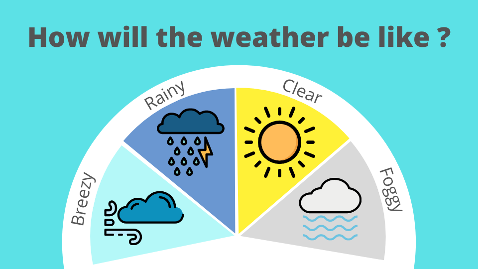

# Weather Analytics

## Introduction
This project will cover weather data analytics using machine learning techniques to determine which attributes may affect the temperature captured.

## Problem Statement
In this dataset, there are multiple 
variables that has been collected, 
which includes: 
- apparent temperature
- humidity
- wind speed
- wind bearing
- visibility
- loud cover
- and pressure
- as well as other variable factors based on the 96453 observations of captured weather data.

The purpose of this study is to predict the temperature based on the above variables using various machine learning algorithms. With multiple variables as the input (X) and a predictable integer variable as the output (Y), regression would be used to solve these type of problems, which in turn, makes this scenario a regression problem.

## Author
🙋‍♀️ Wei Ping 
✉️ weiping.tan.2020@scis.smu.edu.sg  
🇮🇳  https://www.linkedin.com/in/tan-wei-ping-81013118b/  
Git [@weiping](https://github.com/tanweiping)  
